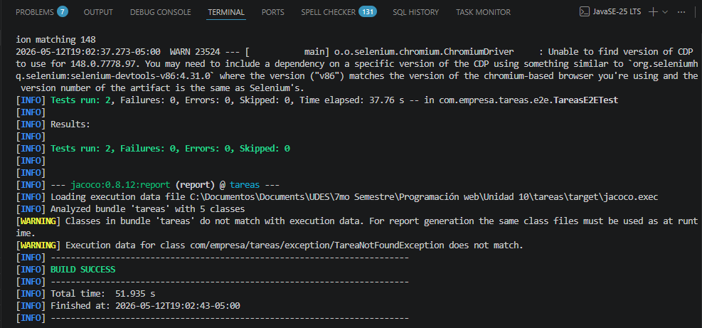
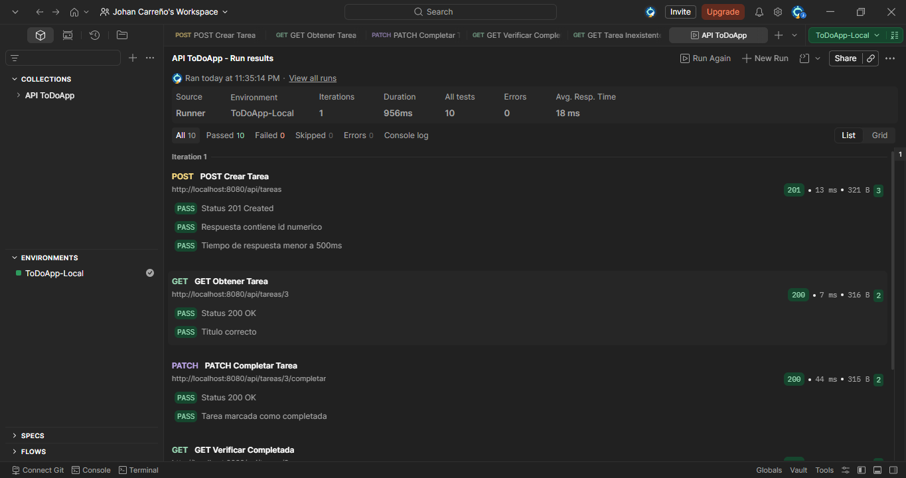
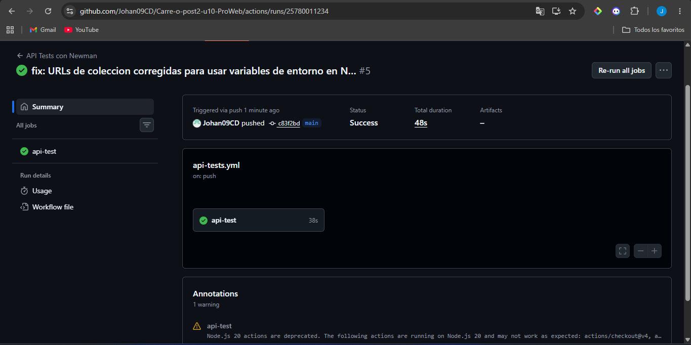

markdown# Pruebas E2E — Post-Contenido 2, Unidad 10

## Descripción

Extensión del proyecto Post-Contenido 1. Se implementan pruebas de extremo
a extremo con Selenium WebDriver aplicando el patrón Page Object Model,
una colección de pruebas de API REST en Postman con test scripts, y
automatización mediante Newman integrado en un pipeline de GitHub Actions.

## Arquitectura de pruebas
Pruebas E2E (Selenium)
↓
TareasPage / NuevaTareaPage (Page Object Model)
↓
Aplicación Spring Boot (localhost:8080)
↓
Pruebas de API (Postman + Newman)
↓
Pipeline CI/CD (GitHub Actions)

## Prerrequisitos

- Java 21+
- Maven 3.9.x
- Google Chrome instalado
- Node.js 18+ con npm
- Postman Desktop v10+
- Newman: `npm install -g newman`

## Cómo ejecutar

### Pruebas Selenium
```cmd
mvn test -Dtest=TareasE2ETest -Dnet.bytebuddy.experimental=true
```

### Pruebas Newman localmente
Primero inicia la aplicación:
```cmd
mvn spring-boot:run
```
Luego en otra terminal:
```cmd
newman run postman/ColeccionToDo.json --environment postman/env-local.json
```

### Pipeline GitHub Actions
El workflow se ejecuta automáticamente en cada push a `main`.
Se puede ver el resultado en la pestaña **Actions** del repositorio.

## Estructura del repositorio
├── .github/
│   └── workflows/
│       └── api-tests.yml
├── postman/
│   ├── ColeccionToDo.json
│   ├── env-local.json
│   └── env-ci.json
├── src/
│   ├── main/
│   │   └── resources/
│   │       └── templates/
│   │           └── tareas.html
│   └── test/
│       └── java/com/empresa/tareas/
│           └── e2e/
│               ├── TareasPage.java
│               ├── NuevaTareaPage.java
│               └── TareasE2ETest.java
└── pom.xml

## Clases Page Object implementadas

| Clase | Descripción |
|-------|-------------|
| TareasPage | Encapsula selectores y acciones de la página principal |
| NuevaTareaPage | Encapsula selectores y acciones del formulario de nueva tarea |

## Colección Postman — 5 requests

| # | Request | Método | Qué verifica |
|---|---------|--------|-------------|
| 1 | POST Crear Tarea | POST | Status 201, id numérico, tiempo < 500ms |
| 2 | GET Obtener Tarea | GET | Status 200, título correcto |
| 3 | PATCH Completar Tarea | PATCH | Status 200, completada = true |
| 4 | GET Verificar Completada | GET | Status 200, completada = true |
| 5 | GET Tarea Inexistente 404 | GET | Status 404 |

## Principios aplicados

- **Page Object Model:** selectores encapsulados en constantes privadas
- **Headless Chrome:** tests E2E sin interfaz gráfica
- **WebDriverManager:** gestión automática del driver de Chrome
- **pm.environment.set:** variables dinámicas entre requests en Newman
- **GitHub Actions:** pipeline CI/CD automatizado en cada push

---

## Evidencias

### Checkpoint 1 — Tests de Selenium en verde
Verificación de que los 2 tests de Selenium pasan correctamente en modo
headless, confirmando que la página carga con el título correcto y el
botón de nueva tarea es visible.



---

### Checkpoint 2 — Postman Runner con 0 failures
Verificación de que la colección de 5 requests ejecuta en orden sin errores,
incluyendo la creación, consulta, completado y verificación de una tarea,
además de la validación del status 404 para recursos inexistentes.



---

### Checkpoint 3 — GitHub Actions con check verde
Verificación de que el workflow `api-tests.yml` ejecuta correctamente en CI,
compilando el JAR, iniciando la aplicación y ejecutando la colección Newman
con todos los tests en verde.

