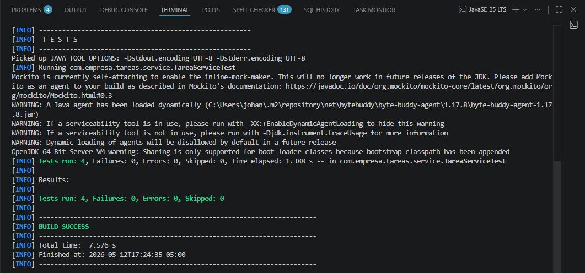
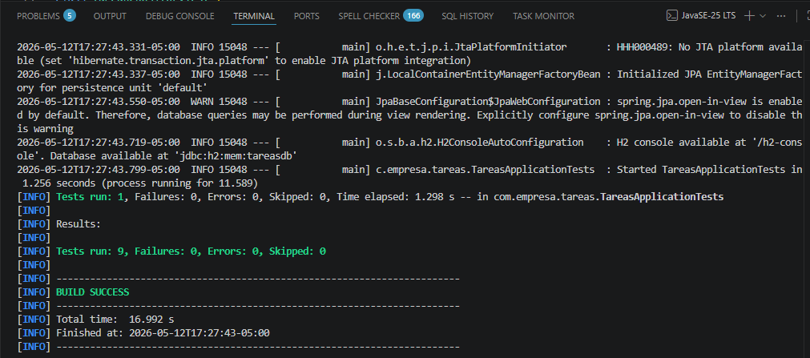
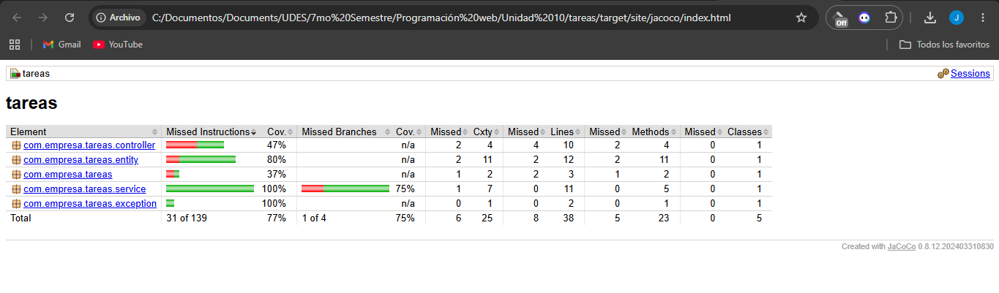

# Suite de Pruebas — Post-Contenido 1, Unidad 10

## Descripción

Aplicación Spring Boot de gestión de tareas con suite de pruebas automatizadas
implementando JUnit 5, Mockito, @WebMvcTest, @DataJpaTest y JaCoCo para
medición de cobertura de código.

## Arquitectura implementada
TareaController (@RestController)
↑
TareaService (@Service)
↑
TareaRepository (JpaRepository)
↑
Tarea (@Entity)

## Cómo ejecutar

1. Clonar el repositorio: https://github.com/Johan09CD/Carre-o-post1-u10-ProWeb
2. Desde la raíz del proyecto ejecutar:

mvn clean test

3. Para generar el reporte de cobertura JaCoCo:

mvn clean test jacoco:report

4. Abrir el reporte en el navegador:

target/site/jacoco/index.html

## Clases de prueba implementadas

| Clase | Tipo | Descripción |
|-------|------|-------------|
| TareaServiceTest | Unitaria (@ExtendWith) | Prueba la lógica de negocio con mocks de Mockito |
| TareaControllerTest | Integración (@WebMvcTest) | Prueba la capa web en aislamiento con MockMvc |
| TareaRepositoryTest | Integración (@DataJpaTest) | Prueba la capa de datos con H2 en memoria |

## Tests implementados

| Test | Clase | Qué verifica |
|------|-------|-------------|
| crear_conTituloValido_guardaYRetorna | TareaServiceTest | Guarda y retorna la tarea correctamente |
| crear_conTituloVacio_lanzaIllegalArgumentException | TareaServiceTest | Lanza excepción si el título está vacío |
| buscarPorId_noExiste_lanzaEntityNotFoundException | TareaServiceTest | Lanza excepción si la tarea no existe |
| completar_tareaExistente_marcaCompletadaYGuarda | TareaServiceTest | Marca la tarea como completada |
| get_tareaExiste_retorna200 | TareaControllerTest | Retorna 200 con la tarea encontrada |
| get_noExiste_retorna404 | TareaControllerTest | Retorna 404 cuando la tarea no existe |
| findByCompletada_false_retornaUnaTarea | TareaRepositoryTest | Filtra tareas por estado completada=false |
| findByCompletada_true_retornaListaVacia | TareaRepositoryTest | Retorna lista vacía cuando no hay completadas |

## Cobertura JaCoCo

- Umbral mínimo configurado: 70% de líneas en el paquete service
- Reporte generado en: target/site/jacoco/index.html
- Clases excluidas: *Application.class y entidades

## Principios aplicados

- **@ExtendWith(MockitoExtension):** pruebas unitarias sin contexto Spring
- **@Mock / @InjectMocks:** inyección de mocks en TareaService
- **@WebMvcTest:** carga solo la capa web sin BD
- **@MockBean:** mock del servicio dentro del contexto Spring
- **@DataJpaTest:** carga solo JPA con H2 en memoria, rollback automático entre tests
- **Patrón de nombres:** método_condición_resultado en todos los tests

---

## Evidencias

### Checkpoint 1 — Pruebas unitarias con Mockito en verde
Verificación de que los 4 tests de `TareaServiceTest` pasan correctamente,
incluyendo la verificación de que `repo.save()` nunca es invocado cuando
el título está vacío.

---

### Checkpoint 2 — Todos los tests en verde
Verificación de que la suite completa de 9 tests pasa sin errores, incluyendo
`TareaControllerTest` con `@WebMvcTest` y `TareaRepositoryTest` con
`@DataJpaTest`.

---

### Checkpoint 3 — Reporte de cobertura JaCoCo
Verificación del reporte generado en `target/site/jacoco/index.html` mostrando
cobertura >= 70% de líneas en el paquete `service`, cumpliendo el umbral
configurado en el plugin jacoco-maven-plugin.

